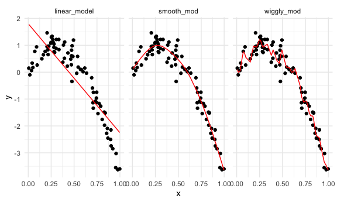
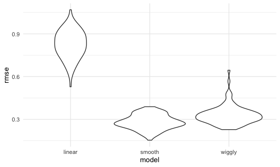
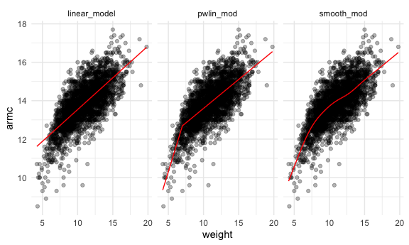
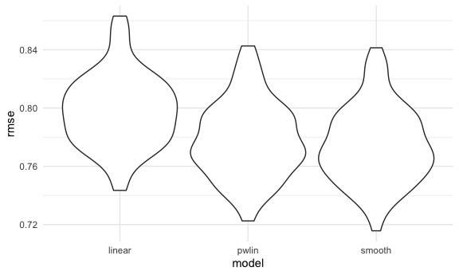

Cross Validation
================

``` r
library(tidyverse)
```

    ## ── Attaching packages ───────────────────────────────────────────────────────────────── tidyverse 1.3.0 ──

    ## ✓ ggplot2 3.3.2     ✓ purrr   0.3.4
    ## ✓ tibble  3.0.3     ✓ dplyr   1.0.0
    ## ✓ tidyr   1.1.0     ✓ stringr 1.4.0
    ## ✓ readr   1.3.1     ✓ forcats 0.5.0

    ## ── Conflicts ──────────────────────────────────────────────────────────────────── tidyverse_conflicts() ──
    ## x dplyr::filter() masks stats::filter()
    ## x dplyr::lag()    masks stats::lag()

``` r
library(modelr)
library(mgcv)
```

    ## Loading required package: nlme

    ## 
    ## Attaching package: 'nlme'

    ## The following object is masked from 'package:dplyr':
    ## 
    ##     collapse

    ## This is mgcv 1.8-33. For overview type 'help("mgcv-package")'.

``` r
knitr::opts_chunk$set(
  fig.width = 6,
  fig.asp = 0.6,
  out.width = "90%"
)

theme_set(theme_minimal() + theme(legend.position = "bottom"))

options(
  ggplot2.continuous.colour = "viridis",
  ggplot2.continuous.fill = "viridis"
)

scale_colour_discrete = scale_colour_viridis_d
scale_fill_discrete = scale_fill_viridis_d
```

## Simulated dataset

``` r
nonlin_df = 
  tibble(
    id = 1:100,
    x = runif(100, 0, 1),
    y = 1 - 10 * (x - .3) ^ 2 + rnorm(100, 0, .3)
  )
```

Look at the data

``` r
nonlin_df %>% 
  ggplot(aes(x = x, y = y)) +
  geom_point()
```


## Cross- validation by hand

Generate a training dataset and a testing dataset

``` r
train_df = sample_n(nonlin_df, size = 80)
test_df = anti_join(nonlin_df, train_df, by = "id")
```

Fit three models.

``` r
linear_model = lm(y ~x, data = train_df)
smooth_mod = gam(y ~ s(x), data = train_df)
wiggly_mod = gam(y ~ s(x, k = 30), sp = 10e-6, data = train_df)
```

Can I see what I just did ?

``` r
train_df %>%
  gather_predictions(linear_model, smooth_mod, wiggly_mod) %>% 
  ggplot(aes(x = x, y = y)) +
  geom_point() +
  geom_line(aes(y = pred), color = "red") + 
  facet_grid(. ~ model)
```



The smooth model does best for prediction accuracy \!

Look at prediction accuracy - (computing the root mean sq for these
model) - use the testing dataset

``` r
rmse(linear_model, data = test_df)
```

    ## [1] 0.8914165

``` r
rmse(smooth_mod, data = test_df)
```

    ## [1] 0.2774172

``` r
rmse(wiggly_mod, data = test_df)
```

    ## [1] 0.2940714

This is what cross validation does - picks the smooth model to pick the
best model to make a prediction.

used when we are looking at unnested datasets.

## Cross validation using `modelr`

``` r
cv_df = 
  crossv_mc(nonlin_df, 100)
```

what is happening here ?

``` r
cv_df %>%  pull(train) %>% .[[1]] %>% as_tibble()
```

    ## # A tibble: 79 x 3
    ##       id      x       y
    ##    <int>  <dbl>   <dbl>
    ##  1     1 0.0927  0.0866
    ##  2     2 0.675  -0.109 
    ##  3     4 0.513   0.288 
    ##  4     5 0.119   0.850 
    ##  5     6 0.981  -3.65  
    ##  6     7 0.985  -3.90  
    ##  7     8 0.655   0.129 
    ##  8     9 0.722  -0.304 
    ##  9    10 0.406   0.930 
    ## 10    12 0.873  -2.09  
    ## # … with 69 more rows

``` r
cv_df %>%  pull(test) %>% .[[1]] %>% as_tibble()
```

    ## # A tibble: 21 x 3
    ##       id      x       y
    ##    <int>  <dbl>   <dbl>
    ##  1     3 0.407   0.565 
    ##  2    11 0.582   0.556 
    ##  3    13 0.0796  0.652 
    ##  4    15 0.0352  0.320 
    ##  5    23 0.195   0.697 
    ##  6    28 0.818  -1.75  
    ##  7    36 0.648  -0.221 
    ##  8    42 0.567  -0.0214
    ##  9    44 0.922  -2.89  
    ## 10    46 0.736  -0.992 
    ## # … with 11 more rows

``` r
cv_df = 
  cv_df %>% 
  mutate(
    train = map(train, as_tibble),
    test = map(test, as_tibble)
  )
```

Let’s try to fit models and get RSME for them

``` r
cv_df = 
cv_df %>% 
  mutate(
    linear_model =  map(.x = train, ~lm(y ~ x, data = .x)),
    smooth_mod = map(.x = train, ~ gam(y ~ s(x), data = .x)),
    wiggly_mod = map(.x = train, ~gam(y ~ s(x, k = 30), sp = 10e-6, data = .x))
  ) %>% 
  mutate(
    rmse_linear = map2_dbl(.x  = linear_model, .y = test, ~rmse(model = .x, data = .y)),
    rmse_smooth = map2_dbl(.x  = smooth_mod, .y = test, ~rmse(model = .x, data = .y)),
    rmse_wiggly = map2_dbl(.x  = wiggly_mod, .y = test, ~rmse(model = .x, data = .y))
  )
```

Produce the RMSE that corresponds to each of these.

What do these results say about model choice

``` r
cv_df %>% 
  select(starts_with("rmse")) %>% 
  pivot_longer(
    everything(),
    names_to = "model",
    values_to = "rmse",
    names_prefix = "rmse_"
  ) %>% 
  ggplot(aes(x = model, y = rmse)) +
  geom_violin()
```



Based on the distribution of the rmse and the plots - we can say that
the smooth model is doing the best.

compute averages…

``` r
cv_df %>% 
  select(starts_with("rmse")) %>% 
  pivot_longer(
    everything(),
    names_to = "model",
    values_to = "rmse",
    names_prefix = "rmse_"
  ) %>% 
  group_by(model) %>% 
  summarize(avg_rmse = mean(rmse))
```

    ## `summarise()` ungrouping output (override with `.groups` argument)

    ## # A tibble: 3 x 2
    ##   model  avg_rmse
    ##   <chr>     <dbl>
    ## 1 linear    0.869
    ## 2 smooth    0.284
    ## 3 wiggly    0.335

smooth is the lowest, hence does better than the other two \!

Try on a real dataset

import data

``` r
child_growth_df = 
  read_csv("./data/nepalese_children.csv") %>% 
  mutate(
    weight_cp = (weight > 7) * (weight - 7)
  )
```

    ## Parsed with column specification:
    ## cols(
    ##   age = col_double(),
    ##   sex = col_double(),
    ##   weight = col_double(),
    ##   height = col_double(),
    ##   armc = col_double()
    ## )

weight vs arm circumference

``` r
child_growth_df %>% 
  ggplot(aes(x = weight, y = armc)) +
  geom_point(alpha = .3)
```


Fit the models we care about

``` r
linear_model = lm(armc ~ weight, data = child_growth_df)
pwlin_mod = lm(armc ~ weight + weight_cp, data = child_growth_df)
smooth_mod = gam(armc ~ s(weight), data = child_growth_df)
```

``` r
child_growth_df %>% 
  gather_predictions(linear_model, pwlin_mod, smooth_mod) %>% 
  ggplot(aes(x = weight, y = armc)) +
  geom_point(alpha = .3) + 
  geom_line(aes(y = pred), color = "red") +
  facet_grid(. ~ model)
```



Which of these id the right model to use for this association? We answer
with performing a cross validation procedure

Try to understand model fit using cross validation dataframe

``` r
cv_df = 
  crossv_mc(child_growth_df, 100) %>% 
  mutate(
    train = map(train, as_tibble),
    test = map(test, as_tibble)
  )
```

See if I can fit the models to the splits

``` r
cv_df = 
cv_df %>% 
  mutate(
    linear_model =  map(.x = train, ~lm(armc ~ weight, data = .x)),
    pwlin_mod = map(.x = train, ~lm(armc ~ weight + weight_cp, data = .x )),
    smooth_mod = map(.x = train, ~ gam(armc ~ s(weight), data = .x))
  ) %>% 
  mutate(
    rmse_linear = map2_dbl(.x  = linear_model, .y = test, ~rmse(model = .x, data = .y)),
    rmse_pwlin = map2_dbl(.x = pwlin_mod, .y = test, ~rmse(model = .x, data = .y)),
    rmse_smooth = map2_dbl(.x  = smooth_mod, .y = test, ~rmse(model = .x, data = .y)),
  )
```

Violin plot

``` r
cv_df %>% 
  select(starts_with("rmse")) %>% 
  pivot_longer(
    everything(),
    names_to = "model",
    values_to = "rmse",
    names_prefix = "rmse_"
  ) %>% 
  ggplot(aes(x = model, y = rmse)) +
  geom_violin()
```


